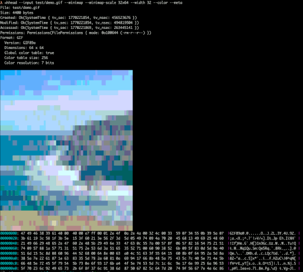

# hhead

A Rust CLI hex dump utility inspired by UltraEdit's binary viewer. `hhead` displays file contents in both hexadecimal and character representations with configurable formatting options.



## Features

- **Configurable display**: Adjust width, byte limits, and grouping
- **Color output**: Optional colorized output for better readability
- **UTF-8 support**: Proper decoding of UTF-8 encoded text
- **Enhanced metadata**: Automatic file format detection with format-specific metadata
- **Binary-safe**: Handles any file type including binary data
- **Format detection**: Identifies common file formats from binary signatures

## Installation

### From Source

```bash
git clone <repository>
cd hhead
cargo build --release
```

The binary will be available at `target/release/hhead`.

### Using Cargo

```bash
cargo install --path .
```

## Usage

```bash
hhead --input <FILE> [OPTIONS]
```

### Basic Example

```bash
hhead --input document.pdf --width 32 --bytes 128
```


## Options

| Option | Description | Default |
|--------|-------------|---------|
| `--input <FILE>` | Input file path (required) | - |
| `--width <N>` | Width of hex display (bytes per line) | 64 |
| `--bytes <N>` | Maximum number of bytes to read | 256 |
| `--color` | Colorize output (cyan offsets, magenta separators) | false |
| `--meta` | Print file metadata before hex dump | false |
| `--utf8` | Decode bytes as UTF-8 text (replaces control chars with '.') | false |

## Command Help

For detailed help with all available options:

```bash
hhead --help
```

This displays the complete command-line interface with descriptions and defaults.

## Enhanced Metadata with `--meta`

When the `--meta` flag is enabled, `hhead` automatically detects file formats from binary signatures and extracts format-specific metadata:

### Supported Formats and Metadata

| Format | Detection Signature | Extracted Metadata |
|--------|---------------------|-------------------|
| **PNG** | `\x89PNG\r\n\x1a\n` | Dimensions, bit depth, color type |
| **JPEG** | `\xff\xd8\xff` | Dimensions, color components |
| **GIF** | `GIF87a` or `GIF89a` | Version, dimensions, color table info |
| **ZIP** | `PK\x03\x04`, `PK\x05\x06`, `PK\x07\x08` | Compression method, file sizes, first filename |
| **GZIP** | `\x1f\x8b` | Compression method, OS, timestamps, flags |
| **TIFF** | `II\x2a\x00` (LE) or `MM\x00\x2a` (BE) | Endianness, IFD offset |
| **PDF** | `%PDF-` | Version |
| **TAR** | `ustar\0` or `ustar ` | First entry name, size, type, timestamps |

### Example Metadata Outputs

```bash
# ZIP file metadata
$ hhead --input archive.zip --meta
Format: ZIP
  Compression: Stored
  Compressed size: 47 bytes
  Uncompressed size: 47 bytes
  First file: test.txt

# PNG image metadata
$ hhead --input image.png --meta
Format: PNG
  Dimensions: 800 x 600
  Bit depth: 8
  Color type: RGB

# GZIP compressed file metadata
$ hhead --input file.gz --meta
Format: GZIP
  Compression: Deflate
  Modification time: 1769523254 Unix timestamp
  OS: Unix
  Flags: 0x08
  Extra flags: 0x00

# PDF document metadata
$ hhead --input document.pdf --meta
Format: PDF
  Version: 1.7
```

The format detection works by analyzing the first 1024 bytes of the file. Standard file metadata (size, timestamps, permissions) is always shown when `--meta` is enabled.

## Examples

### Basic Hex Dump
```bash
hhead --input test.txt --width 16
```
```
00000000: 48 65 6c 6c 6f 20 57 6f  72 6c 64 21 20 54 68 69  |Hello World! Thi |
00000010: 73 20 69 73 20 61 20 74  65 73 74 20 66 69 6c 65  |s is a test file |
00000020: 20 66 6f 72 20 68 65 78  20 64 75 6d 70 2e 0a     | for hex dump..  |
```

### With Enhanced Metadata and Color
```bash
hhead --input test.png --meta --color --bytes 64
```
```
File: test.png
Size: 67 bytes
Created: Ok(SystemTime { tv_sec: 1769525204, tv_nsec: 903678782 })
Modified: Ok(SystemTime { tv_sec: 1769525204, tv_nsec: 903912788 })
Accessed: Ok(SystemTime { tv_sec: 1769525206, tv_nsec: 740812208 })
Permissions: Permissions(FilePermissions { mode: 0o100644 (-rw-r--r--) })
Format: PNG
  Dimensions: 1 x 1
  Bit depth: 8
  Color type: Grayscale

00000000: 89 50 4e 47 0d 0a 1a 0a  00 00 00 0d 49 48 44 52  |.PNG........IHDR|
00000010: 00 00 00 01 00 00 00 01  08 00 00 00 00 3a 7e 9b  |...............:~.|
00000020: 55 00 00 00 0a 49 44 41  54 78 9c 63 60 00 00 00  |U....IDATx.c`...|
00000030: 02 00 01 48 af a4 71 00  00 00 00 49 45 4e 44 ae  |...H..q....IEND.|
```

### With charactor map

256 Color Characters with sampling GRID:

```
hhead --input test/demo.gif --minimap --minimap-scale 32x64 --width 32 --color --meta
```

### UTF-8 Text with Emoji
```bash
hhead --input utf8.txt --utf8 --width 24
```
```
00000000: 48 65 6c 6c 6f 20 e4 b8  96 e7 95 8c 20 f0 9f 8e  89 0a              |Hello 世界 🎉.       |
```

### Archive File with Enhanced Metadata
```bash
hhead --input test.zip --meta --width 32
```
```
File: test.zip
Size: 213 bytes
Created: Ok(SystemTime { tv_sec: 1769525117, tv_nsec: 778788083 })
Modified: Ok(SystemTime { tv_sec: 1769525117, tv_nsec: 780262916 })
Accessed: Ok(SystemTime { tv_sec: 1769525117, tv_nsec: 778788083 })
Permissions: Permissions(FilePermissions { mode: 0o100644 (-rw-r--r--) })
Format: ZIP
  Compression: Stored
  Compressed size: 47 bytes
  Uncompressed size: 47 bytes
  First file: test.txt

00000000: 50 4b 03 04 0a 00 00 00  00 00 c7 b1 3b 5c f5 9e  fb 90 2f 00 00 00 2f 00  00 00 08 00 1c 00 74 65  |PK..........;\..../.../.......te|
00000040: 73 74 2e 74 78 74 55 54  09 00 03 36 c8 78 69 37  c8 78 69 75 78 0b 00 01  04 f5 01 00 00 04 14 00  |st.txtUT...6.xi7.xiux...........|
00000080: 00 00 48 65 6c 6c 6f 20  57 6f 72 6c 64 21 20 54  68 69 73 20 69 73 20 61  20 74 65 73 74 20 66 69  |..Hello World! This is a test fi|
000000c0: 6c 65 20 66 6f 72 20 68  65 78 20 64 75 6d 70 2e  0a 50 4b 01 02 1e 03 0a  00 00 00 00 00 c7 b1 3b  |le for hex dump..PK............;|
```

## Output Format

The hex dump format consists of three sections:

1. **Offset**: 8-digit hexadecimal address (e.g., `00000000:`)
2. **Hex bytes**: Bytes displayed in hexadecimal, grouped in 8-byte chunks
3. **Character representation**: ASCII or UTF-8 characters, with non-printable characters shown as `.`

## Building from Source

### Dependencies
- Rust 1.70+ and Cargo

### Build Steps
```bash
# Debug build
cargo build

# Release build (optimized)
cargo build --release

# Run tests
cargo test

# Check for warnings
cargo check
```

## Project Structure

```
hhead/
├── Cargo.toml          # Project configuration and dependencies
├── src/
│   └── main.rs         # Main application code
└── README.md           # This file
```

## License

This project is available for use under the MIT License.

## Contributing

1. Fork the repository
2. Create a feature branch
3. Implement changes with tests
4. Submit a pull request
