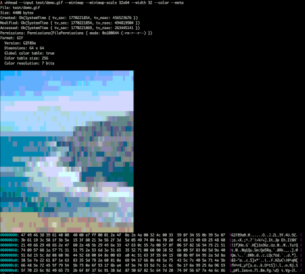

# hhead

A Rust CLI hex-dump utility inspired by UltraEdit's binary viewer. `hhead` shows a file's contents in hexadecimal and character form, with optional color, UTF-8 decoding, format-specific metadata, and an image minimap.



> Looking to hack on `hhead` or send a pull request? See [DEVELOPMENT.md](./DEVELOPMENT.md).

---

## Features

- **Configurable display** — adjust bytes-per-line, byte limits, and grouping.
- **Color output** — cyan offsets, magenta separators, colorized minimap.
- **UTF-8 mode** — decode multibyte text instead of stripping it to ASCII.
- **File metadata** — size, timestamps, permissions.
- **Format detection** — PNG, JPEG, GIF, BMP, ZIP, GZIP, TAR, TIFF, PDF, with format-specific fields (dimensions, compression, version, …).
- **Image minimap** — a 256-color thumbnail of PNG / JPEG / BMP images, rendered inline in your terminal.
- **Binary-safe** — handles any file type.

## Installation

### Prerequisites

- **Rust 1.85+** (the crate targets Rust edition 2024).
- A terminal that understands ANSI escapes if you want colors or the minimap.

### From source

```bash
git clone https://github.com/yfyang86/hhead
cd hhead
cargo build --release
# binary at target/release/hhead
```

### Via cargo

```bash
cargo install --path .
```

## Usage

```bash
hhead --input <FILE> [OPTIONS]
```

### Quick start

```bash
hhead --input document.pdf --width 32 --bytes 128
```

### Options

| Option | Description | Default |
|---|---|---|
| `--input <FILE>` | Input file path (required) | — |
| `--width <N>` | Bytes per line in the hex column | `64` |
| `--bytes <N>` | Maximum number of bytes to read | `256` |
| `--color` | Colorize offsets and separators | off |
| `--meta` | Print file metadata before the hex dump | off |
| `--utf8` | Decode the character column as UTF-8 | off |
| `--minimap` | Render a 256-color thumbnail of image input | off |
| `--minimap-scale <ROWSxCOLS>` | Thumbnail grid size, e.g. `8x12` | `8x12` |

Full help:

```bash
hhead --help
```

## Examples

### Basic hex dump

```bash
hhead --input test.txt --width 16
```

```
00000000: 48 65 6c 6c 6f 20 57 6f  72 6c 64 21 20 54 68 69  |Hello World! Thi |
00000010: 73 20 69 73 20 61 20 74  65 73 74 20 66 69 6c 65  |s is a test file |
00000020: 20 66 6f 72 20 68 65 78  20 64 75 6d 70 2e 0a     | for hex dump..  |
```

### With metadata and color

```bash
hhead --input test.png --meta --color --bytes 64
```

```
File: test.png
Size: 67 bytes
Created: 1769525204 (unix)
Modified: 1769525204 (unix)
Accessed: 1769525206 (unix)
Permissions: 0644
Format: PNG
  Dimensions: 1 x 1
  Bit depth: 8
  Color type: Grayscale

00000000: 89 50 4e 47 0d 0a 1a 0a  00 00 00 0d 49 48 44 52  |.PNG........IHDR|
00000010: 00 00 00 01 00 00 00 01  08 00 00 00 00 3a 7e 9b  |.............:~.|
00000020: 55 00 00 00 0a 49 44 41  54 78 9c 63 60 00 00 00  |U....IDATx.c`...|
00000030: 02 00 01 48 af a4 71 00  00 00 00 49 45 4e 44 ae  |...H..q....IEND.|
```

### UTF-8 text with emoji

```bash
hhead --input utf8.txt --utf8 --width 24
```

```
00000000: 48 65 6c 6c 6f 20 e4 b8  96 e7 95 8c 20 f0 9f 8e  89 0a              |Hello 世界 🎉.       |
```

> **Note.** In UTF-8 mode the trailing `|` column is only strictly aligned for ASCII input — wide (CJK, emoji) and combining characters don't map 1:1 to terminal cells.

### Image minimap

```bash
hhead --input test/demo.gif --minimap --minimap-scale 32x64 --width 32 --color --meta
```

Renders a 32×64 grid of 256-color blocks sampled from the image, followed by the usual metadata and hex dump.

### Archive with format metadata

```bash
hhead --input test.zip --meta --width 32
```

```
File: test.zip
Size: 213 bytes
Created: 1769525117 (unix)
Modified: 1769525117 (unix)
Accessed: 1769525117 (unix)
Permissions: 0644
Format: ZIP
  Compression: Stored
  Compressed size: 47 bytes
  Uncompressed size: 47 bytes
  First file: test.txt

00000000: 50 4b 03 04 0a 00 00 00  00 00 c7 b1 3b 5c f5 9e  fb 90 2f 00 00 00 2f 00  00 00 08 00 1c 00 74 65  |PK..........;\..../.../.......te|
00000040: 73 74 2e 74 78 74 55 54  09 00 03 36 c8 78 69 37  c8 78 69 75 78 0b 00 01  04 f5 01 00 00 04 14 00  |st.txtUT...6.xi7.xiux...........|
00000080: 00 00 48 65 6c 6c 6f 20  57 6f 72 6c 64 21 20 54  68 69 73 20 69 73 20 61  20 74 65 73 74 20 66 69  |..Hello World! This is a test fi|
000000c0: 6c 65 20 66 6f 72 20 68  65 78 20 64 75 6d 70 2e  0a 50 4b 01 02 1e 03 0a  00 00 00 00 00 c7 b1 3b  |le for hex dump..PK............;|
```

## Supported formats with `--meta`

`hhead` inspects the first 1024 bytes of the input and, if the magic bytes match a known format, prints extra fields.

| Format | Magic | Extracted fields |
|---|---|---|
| PNG | `\x89PNG\r\n\x1a\n` | Dimensions, bit depth, color type |
| JPEG | `\xff\xd8\xff` | Dimensions, components |
| BMP | `BM` | Dimensions, bits per pixel, compression, orientation |
| GIF | `GIF87a` / `GIF89a` | Version, dimensions, color-table info |
| ZIP | `PK\x03\x04` / `\x05\x06` / `\x07\x08` | Compression method, sizes, first filename |
| GZIP | `\x1f\x8b` | Compression, modified time, OS, flags |
| TIFF | `II\x2a\x00` / `MM\x00\x2a` | Endianness, IFD offset |
| PDF | `%PDF-` | Version |
| TAR | `ustar\0` / `ustar ` | First entry name, size, type, mtime |

## Output format

Each hex row has three sections:

1. **Offset** — 8 hex digits (16 for files larger than 4 GiB), e.g. `00000000:`.
2. **Hex bytes** — each byte as two lowercase hex digits, grouped in blocks of 8.
3. **Character column** — printable ASCII (or UTF-8 when `--utf8` is set) wrapped in `|…|`; non-printable bytes render as `.`.

## License

MIT. See [LICENSE](./LICENSE).
