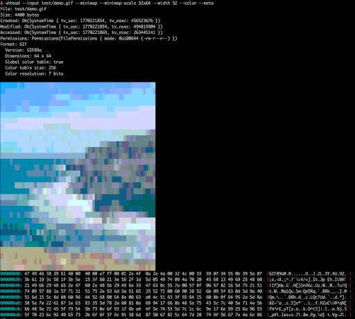

# hhead

A Rust CLI hex-dump utility inspired by UltraEdit's binary viewer. `hhead` shows a file's contents in hexadecimal and character form, with optional color, UTF-8 decoding, format-specific metadata, and an image minimap.



> Looking to hack on `hhead` or send a pull request? See [DEVELOPMENT.md](./DEVELOPMENT.md).
>
> Long-form recipes, FAQ, and format-internals reference live in the [project wiki](https://github.com/yfyang86/hhead/wiki) (sources in [`wiki/`](./wiki)).

---

## Features

- **Configurable display** — adjust bytes-per-line, byte limits, and grouping.
- **Color output** — cyan offsets, magenta separators, colorized minimap.
- **UTF-8 mode** — decode multibyte text instead of stripping it to ASCII.
- **File metadata** — size, timestamps, permissions.
- **Format detection** — PNG, JPEG, GIF, BMP, ZIP, GZIP, TAR, TIFF, PDF, with format-specific fields (dimensions, compression, version, …).
- **Image minimap** — a 256-color thumbnail of PNG / JPEG / BMP images, rendered inline in your terminal.
- **Markdown mode** — render Markdown with aligned GFM tables and inline image figures instead of a hex dump.
- **Any-document mode** — `--mode-anydoc` converts PDF, DOCX, XLSX, CSV, EPUB, … to Markdown (via [anydoc](https://crates.io/crates/anydoc)) and renders it like `--markdown` (which is implied).
- **Pager mode** — page through any output (`--mode-less`) with a built-in `less`-style pager: scroll, search, jump.
- **Directory mode** — point `--input` at a directory to get a `tree`-style listing; `--meta` adds an `ls -lah`/`du -sh`-style block.
- **Rainbow CSV** — `--csv-rainbow` paints each CSV/TSV column in its own color; with `--markdown` or `--mode-anydoc`, table columns get the same palette.
- **Binary-safe** — handles any file type.

## Installation

### Prerequisites

- **Rust 1.88+** (`anydoc`'s MSRV; the crate itself targets edition 2024).
- A terminal that understands ANSI escapes if you want colors or the minimap.

### From source

```bash
git clone https://github.com/yfyang86/hhead
cd hhead
cargo build --release
# binary at target/release/hhead
```

### Via cargo

```bash
cargo install --path .
```

## Usage

```bash
hhead --input <FILE|DIR> [OPTIONS]
```

### Quick start

```bash
hhead --input document.pdf --width 32 --bytes 128
```

### Options

| Option | Description | Default |
|---|---|---|
| `--input <PATH>` | Input file, or a directory to list as a tree (required) | — |
| `--width <N>` | Bytes per line in the hex column | `64` |
| `--bytes <N>` | Maximum number of bytes to read | `256` |
| `--color` | Colorize offsets and separators | off |
| `--meta` | Print file metadata before the hex dump | off |
| `--utf8` | Decode the character column as UTF-8 | off |
| `--minimap` | Render a 256-color thumbnail of image input | off |
| `--minimap-scale <ROWSxCOLS>` | Thumbnail grid size, e.g. `8x12` | `8x12` |
| `--markdown` | Render Markdown input instead of a hex dump (aligned tables; figures as minimaps) | off |
| `--mode-less` | Page through the output interactively, like `less` (works with the other options; the `--bytes` limit does not apply) | off |
| `--mode-anydoc` | Convert the input to Markdown first (via `anydoc`), then render it like `--markdown` (which is implied) | off |
| `--csv-rainbow` | Paint each CSV/TSV column in its own color (implies `--color`; whole file, `--bytes` does not apply); with `--markdown`/`--mode-anydoc`, table columns get the same palette | off |

Full help:

```bash
hhead --help
```

## Examples

### Basic hex dump

```bash
hhead --input test.txt --width 16
```

```
00000000: 48 65 6c 6c 6f 20 57 6f  72 6c 64 21 20 54 68 69  |Hello World! Thi |
00000010: 73 20 69 73 20 61 20 74  65 73 74 20 66 69 6c 65  |s is a test file |
00000020: 20 66 6f 72 20 68 65 78  20 64 75 6d 70 2e 0a     | for hex dump..  |
```

### With metadata and color

```bash
hhead --input test.png --meta --color --bytes 64
```

```
File: test.png
Size: 67 bytes
Created: 1769525204 (unix)
Modified: 1769525204 (unix)
Accessed: 1769525206 (unix)
Permissions: 0644
Format: PNG
  Dimensions: 1 x 1
  Bit depth: 8
  Color type: Grayscale

00000000: 89 50 4e 47 0d 0a 1a 0a  00 00 00 0d 49 48 44 52  |.PNG........IHDR|
00000010: 00 00 00 01 00 00 00 01  08 00 00 00 00 3a 7e 9b  |.............:~.|
00000020: 55 00 00 00 0a 49 44 41  54 78 9c 63 60 00 00 00  |U....IDATx.c`...|
00000030: 02 00 01 48 af a4 71 00  00 00 00 49 45 4e 44 ae  |...H..q....IEND.|
```

### UTF-8 text with emoji

```bash
hhead --input utf8.txt --utf8 --width 24
```

```
00000000: 48 65 6c 6c 6f 20 e4 b8  96 e7 95 8c 20 f0 9f 8e  89 0a              |Hello 世界 🎉.       |
```

> **Note.** In UTF-8 mode the trailing `|` column is only strictly aligned for ASCII input — wide (CJK, emoji) and combining characters don't map 1:1 to terminal cells.

### Image minimap

```bash
hhead --input test/demo.gif --minimap --minimap-scale 32x64 --width 32 --color --meta
```

Renders a 32×64 grid of 256-color blocks sampled from the image, followed by the usual metadata and hex dump.

### Markdown rendering

```bash
hhead --input notes.md --markdown --color
```

Renders the whole file instead of a hex dump (the `--bytes` limit does not apply): headings, fenced code blocks, and inline emphasis are styled, and GFM tables are padded and aligned per the separator row (`:--`, `--:`, `:-:`):

```
| Language | Stars | Trend |
|----------|-------|-------|
| Rust     |  100k |  up   |
| Go       |   90k | flat  |
```

A lone `` line is drawn as a 256-color minimap on the `--minimap-scale` grid, resolved relative to the Markdown file. Remote (`http(s)://`) and undecodable images fall back to a one-line placeholder.

### Any-document mode

```bash
hhead --input report.docx --mode-anydoc --color
hhead --input data.csv --mode-anydoc --mode-less   # page the converted table
```

`--mode-anydoc` converts the input to Markdown with [anydoc](https://crates.io/crates/anydoc)
(PDF, DOCX/ODT, PPTX, XLSX/XLS, ODS, RTF, EPUB, CSV, …) and then renders it
exactly like `--markdown`, which is implied — the whole file is converted, so
the `--bytes` limit does not apply, and `--mode-less` pages the result. If
`anydoc` cannot convert the file, `hhead` warns on stderr and falls back:
text input (e.g. already-Markdown files) is rendered as Markdown, anything
else is shown as a hex dump.

### Pager mode

```bash
hhead --input big.log --mode-less --color --meta
```

`--mode-less` runs the built-in pager (no external `less` needed) on whatever
the other options produce — the full hex dump, Markdown render, minimap, or
metadata block. It reads the whole file, so the `--bytes` limit does not
apply (like `--markdown`). Keys:

| Key | Action |
|---|---|
| `q` / `Esc` | quit |
| `j` / `↓` / `Enter` | scroll down one line |
| `k` / `↑` | scroll up one line |
| `Space` / `f` / `PgDn` | page down |
| `b` / `PgUp` | page up |
| `g` / `G` | jump to top / bottom |
| `/` | search forward (case-insensitive); `Enter` to run, `Esc` to cancel |
| `n` / `N` | next / previous match |

If stdin or stdout is not a terminal, the pager falls back to dumping the
whole output, so piping still works.

### Rainbow CSV

```bash
hhead --input data.csv --csv-rainbow
hhead --input report.md --markdown --csv-rainbow   # rainbow table columns
hhead --input data.xlsx --mode-anydoc --csv-rainbow
```

`--csv-rainbow` renders CSV/TSV input as text with every column painted in
its own color (cyan, yellow, green, magenta, blue, red, cycling), leaving
the layout untouched. Parsing is quote-aware — a quoted field keeps embedded
delimiters and even line breaks in one field's color — and the delimiter
(`,`, tab, or `;`) is sniffed from the first line. The flag implies
`--color`, reads the whole file like Markdown mode, and pages with
`--mode-less`. Combined with `--markdown` or `--mode-anydoc`, table columns
are painted with the same palette instead. Non-UTF-8 input falls back to
the hex dump.

### Directory tree

```bash
hhead --input src --meta --color
```

When `--input` is a directory, `hhead` lists it as a tree (like `tree`)
instead of hex-dumping. With `--meta`, the tree is preceded by an
`ls -lah`-style listing of the directory's entries (mode, human-readable
size, UTC mtime) and a `du -sh *`-style block of recursive sizes with a
total. `--color` paints directories blue, symlinks cyan, executables green,
and sizes yellow; `--mode-less` pages the listing.

```
Directory: src
drwxr-xr-x   4.0K Sep  1 08:51 cli
-rw-r--r--    482 Sep  1 08:48 lib.rs
...

  2.1K	cli
   482	lib.rs
...
   94K	total

src
├── cli
│   ├── args.rs
│   └── mod.rs
├── lib.rs
└── ...

5 directories, 18 files
```

### Archive with format metadata

```bash
hhead --input test.zip --meta --width 32
```

```
File: test.zip
Size: 213 bytes
Created: 1769525117 (unix)
Modified: 1769525117 (unix)
Accessed: 1769525117 (unix)
Permissions: 0644
Format: ZIP
  Compression: Stored
  Compressed size: 47 bytes
  Uncompressed size: 47 bytes
  First file: test.txt

00000000: 50 4b 03 04 0a 00 00 00  00 00 c7 b1 3b 5c f5 9e  fb 90 2f 00 00 00 2f 00  00 00 08 00 1c 00 74 65  |PK..........;\..../.../.......te|
00000040: 73 74 2e 74 78 74 55 54  09 00 03 36 c8 78 69 37  c8 78 69 75 78 0b 00 01  04 f5 01 00 00 04 14 00  |st.txtUT...6.xi7.xiux...........|
00000080: 00 00 48 65 6c 6c 6f 20  57 6f 72 6c 64 21 20 54  68 69 73 20 69 73 20 61  20 74 65 73 74 20 66 69  |..Hello World! This is a test fi|
000000c0: 6c 65 20 66 6f 72 20 68  65 78 20 64 75 6d 70 2e  0a 50 4b 01 02 1e 03 0a  00 00 00 00 00 c7 b1 3b  |le for hex dump..PK............;|
```

## Supported formats with `--meta`

`hhead` inspects the first 1024 bytes of the input and, if the magic bytes match a known format, prints extra fields.

| Format | Magic | Extracted fields |
|---|---|---|
| PNG | `\x89PNG\r\n\x1a\n` | Dimensions, bit depth, color type |
| JPEG | `\xff\xd8\xff` | Dimensions, components |
| BMP | `BM` | Dimensions, bits per pixel, compression, orientation |
| GIF | `GIF87a` / `GIF89a` | Version, dimensions, color-table info |
| ZIP | `PK\x03\x04` / `\x05\x06` / `\x07\x08` | Compression method, sizes, first filename |
| GZIP | `\x1f\x8b` | Compression, modified time, OS, flags |
| TIFF | `II\x2a\x00` / `MM\x00\x2a` | Endianness, IFD offset |
| PDF | `%PDF-` | Version |
| TAR | `ustar\0` / `ustar ` | First entry name, size, type, mtime |

## Output format

Each hex row has three sections:

1. **Offset** — 8 hex digits (16 for files larger than 4 GiB), e.g. `00000000:`.
2. **Hex bytes** — each byte as two lowercase hex digits, grouped in blocks of 8.
3. **Character column** — printable ASCII (or UTF-8 when `--utf8` is set) wrapped in `|…|`; non-printable bytes render as `.`.

## License

MIT. See [LICENSE](./LICENSE).
